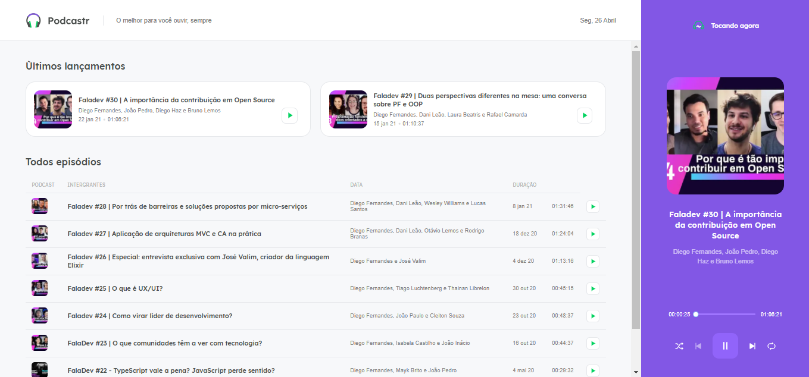
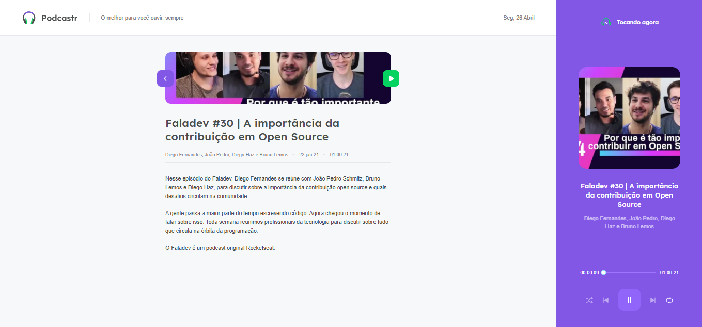

<h3 align="center">
    
    <br><br>
    <b> Sistema de Podcastr para Devs, no intuido de aproximar ainda mais os melhores podcastr de tecnologias!</b>  
    <br>
</h3>

<br>

# Índice

- [Sobre](#sobre)
- [Tecnologias Utilizadas](#tecnologias-utilizadas)
- [Como Usar](#como-usar)
- [Como Contribuir](#como-contribuir)

<a id="sobre"></a>


## :bookmark: Sobre

	
O <strong>Podcastr$</strong>é uma aplicação Web Voltada pra Devs que buscam se atualizar com as novas tecnologias do mercado, no intuido de acessar uma Playlista com os melhores conteudos de programação.

Essa aplicação foi construída na trilha <strong>Next Level Week#05</strong> foi distribuída pela [Rocketseat](https://rocketseat.com.br/). A ideia de criar uma aplicação voltada para Podcastr de tecnologias, surgiu da necessidade de incentivar as pessoas a consumir e se atualizar com os melhores conteudos de programação abordado no mercado de tecnologia.

<br>


<a id="tecnologias-utilizadas"></a>

## :rocket: Tecnologias Utilizadas

O projeto foi desenvolvido utilizando as seguintes tecnologias


- [React](https://reactjs.org/)
- [Nextjs](https://nextjs.org/)
- [Typescrip](https://www.typescriptlang.org/)
- [Sass](https://sass-lang.com/documentation)


## :heavy_check_mark: :computer: Prototipo da Aplicação

- O layout está disponível no **[Figma](https://www.figma.com/file/PpIE8ON2CSKxLTwXUM3lTM/Podcastr-(Copy)?node-id=160%3A2761))**;


## :heavy_check_mark: :computer: Resultado Web

<h1 align="center">
    
</h1>
</br>
<h1 align="center">
    
</h1>


<a id="como-usar"></a>


## :fire: Como usar


1. Faça um clone :

```sh
  $ git clone https://github.com/Rafael-Rufino/Podcastr_Trilha_React_NLW-05.git

```

```sh
2. Executando a Aplicação:
  # Install as dependências
  $ yarn install

  # Inicie a aplicação web
  $ cd  podcastrnext
  $ npm run dev
  # or
  yarn dev

  #Iniciar o json server
  $ cd  podcastrnext
  $ npm run server
  # or
  yarn server

  # Acessar o Servidor no Browser
  $ http://127.0.0.1:3000/
 
  # Porta de Acesso Definida
  $ 3000

```


## :recycle: Como contribuir

- Faça um Fork desse repositório,
- Crie uma branch com a sua feature: `git checkout -b my-feature`
- Commit suas mudanças: `git commit -m 'feat: My new feature'`
- Push a sua branch: `git push origin my-feature`


🎓 **Quem ministrou?**

As aulas foram ministradas pelo mestre Diego Fernandes - Instructor - Rocketseat nas aulas do Next Level Week.

📝 **License**

Esse projeto está sob a licença MIT. Veja o arquivo [LICENSE](LICENSE.md) para mais detalhes.


<h4 align="center">
    Feito com 💜 by <a href="https://www.linkedin.com/in/rafael-r-dos-santos-b889311ba/" target="_blank">Rafael Rufino</a>
</h4>


